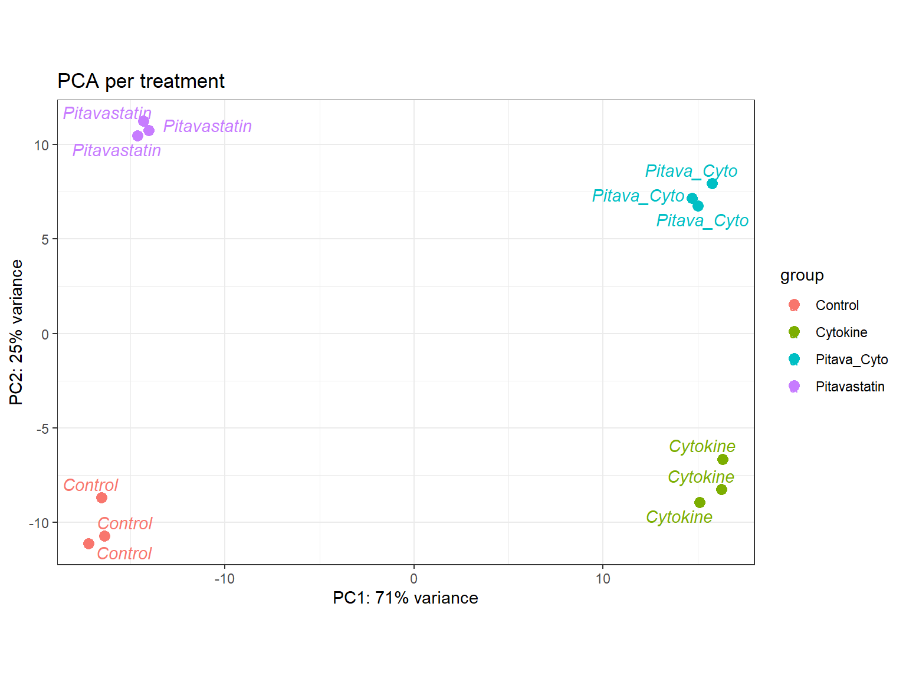
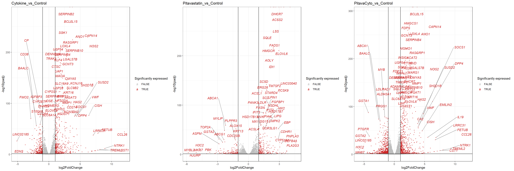
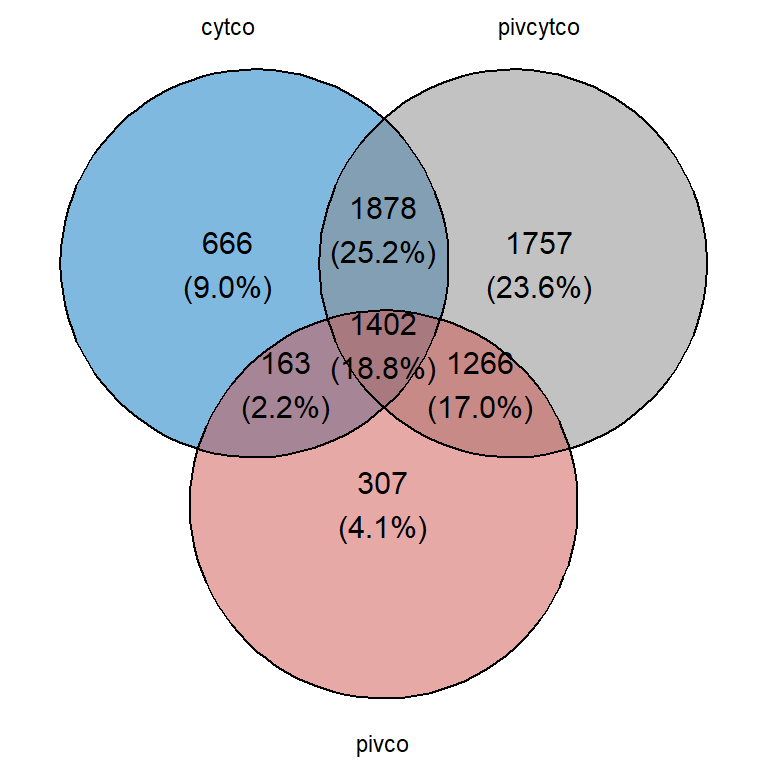
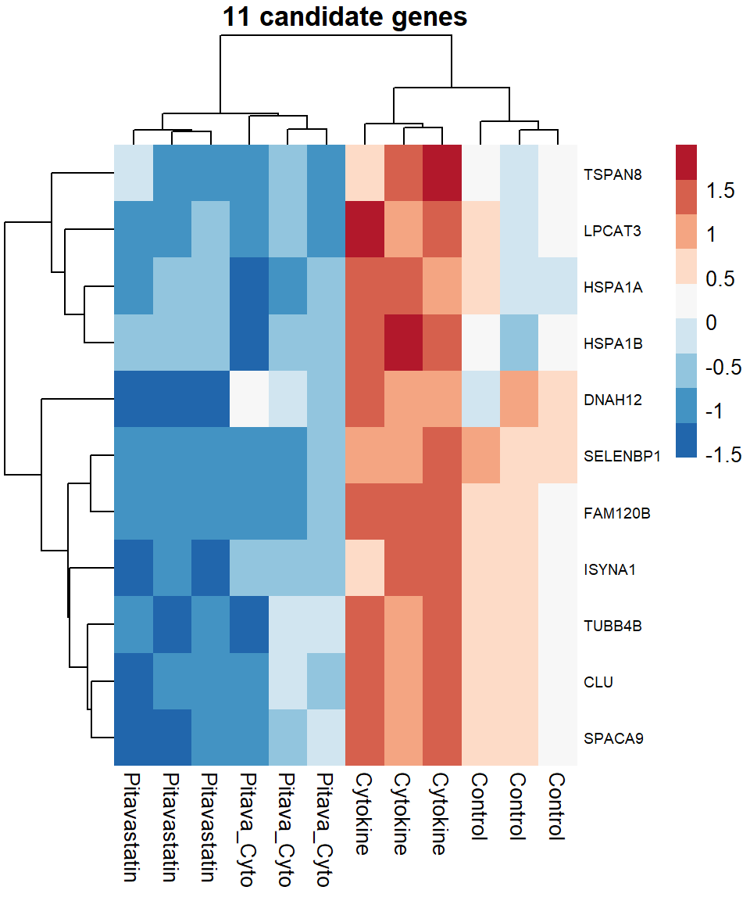

# Primary lung cells and SPREADs: RNAseq analysis of cytokine and pitavastatin treatment
## Introduction
This is a collaboration with Amir Zeki and Kenneth Chmiel from Pulmonary, Critical Care and Sleep Medicine at the UCD med center.
Kenneth did RNAseq on lung primary cells treated with
- Control
- Pitavastatin
- Cytokines (IL4, IL5, IL13) -> to be verified
- Pitavastatin + Cytokines

That data was aligned by the genome center, we have the preliminary reports.

Motivation for this study: We want to know what pathways/processes changed after different treatments. We are specifically interested in seeing why cytokines (IL5, IL13, ILxx) induce SPREADS but do not when coupled with pitavastatin.
So, ultimately, what is pitavastatin suppressing?

## Content of this repository

- DESeq2.R: Producing the annotation data and the dds object.
- qc_report_genome_center.html: quality control of the alignment of the data
- initial_report_genome_center: describes each sample (used for annotations) and did a basic PCA + how many genes are differentially expressed when comparing conditions.
- Primary_cell_report1.Rmd + .html

## Primary cell report 1

### PCA of the 12 samples

### Volcano plots of DEG all conditions vs control

### Venn diagram of the shared/distinct DEG between conditions (vs control)

Out of the 1878 + 1402 differentially expressed genes between Cytokine and Pitavastatin + Cytokines vs ctrl, we selected those that were
-  UP in cytokine vs ctrl AND
-  DOWN in pitavastatin + cytokine vs control

There are 11 such genes, I produced a heatmap for those and did an ORA enrichment analysis.

Out of the 1878 + 1402 DEGs between Cytokine and Pitavastatin + Cytokines vs ctrl, we selected those that were
- UP in cytokine
- DOWN or UNCHANGED in pitavastatin + cytokine vs control

There are 377 such genes, I produced a heatmap for those and did an ORA.

